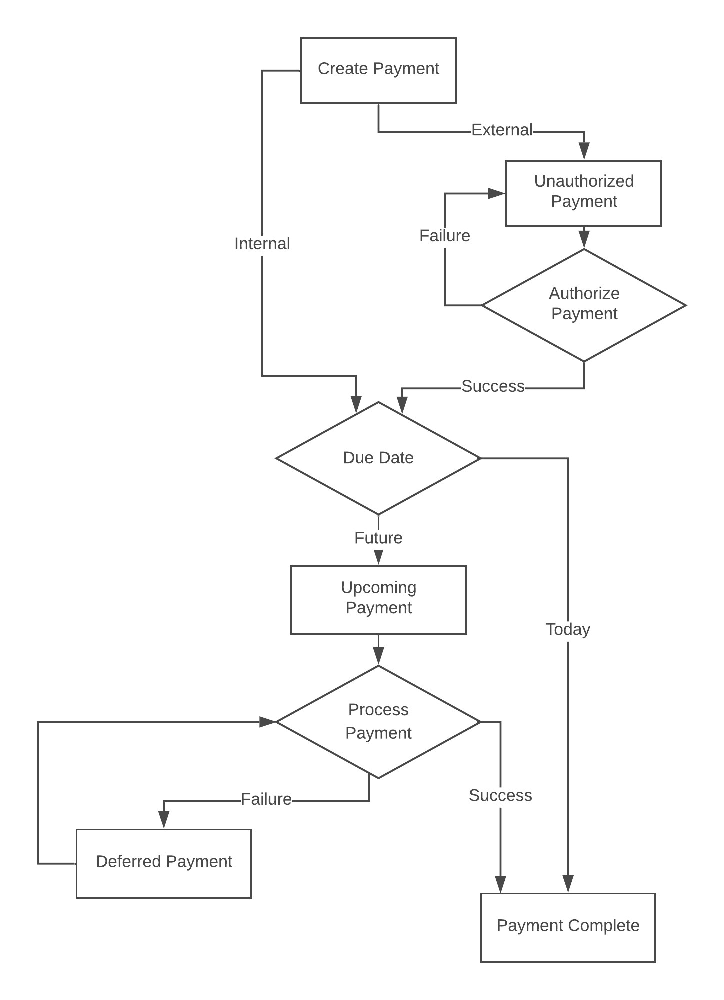
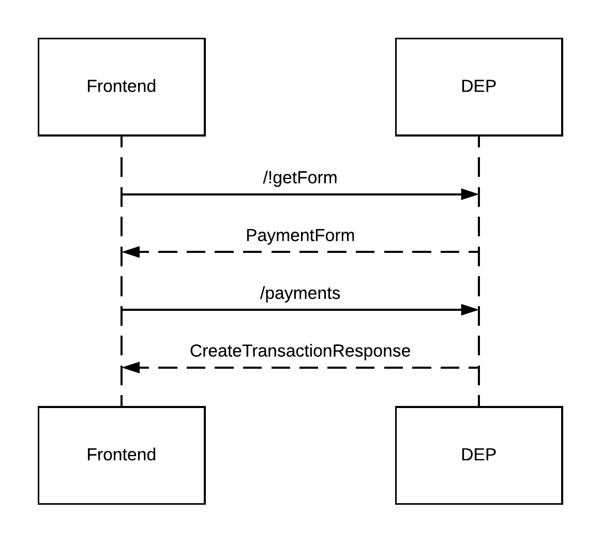
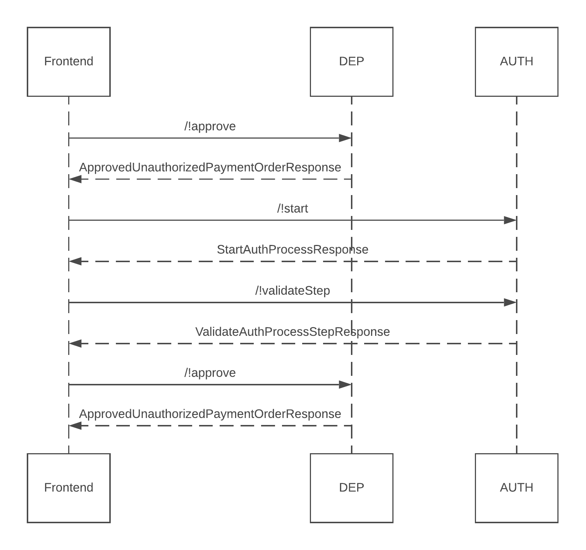

# IB Deposits

The **deposit service** is responsible allowing a user to view and manage their deposit product accounts and create payments.

## Responsibility of the service

#### Deposit Product Account
A [deposit product]() is created during the onboarding process (see [user activation service](https://doc.ffc.internal/book/mw-ib/mw-gen-user-activation-ib.html)).

A customer can have more than one deposit product.

An account can have multiple currency components, where one is designated as the *primary currency*. The customer has the ability to change the primary currency. The aggregated balance of the account will appear in the primary currency.

#### Transactions

The service allows a customer to retrieve and search all their transactions. They also have the ability to update some transaction data i.e add a note etc.

The platform supports *automatic currency conversion* with incoming/outgoing transactions. This can occur when an account has insufficient funds when making an outgoing payment, or an incoming payment is in a currency that is not supported by that account. Thus, a single transaction can contain multiple sub currency conversions and fees.

As a result, there are two types of transactions:
- `RequiredTransaction`: Represents the “primary transaction” being carried out. Includes fees and any necessary auto conversions between currency components to satisfy a payment order i.e a required transaction can contain multiple *transactions(processedTransactions)*.
- `Transaction(processedTransaction)`: Represents a single transaction i.e a currency conversion or fee. For every transaction there is one *RequiredTransaction*.

Transaction statuses:
- `RESERVED`: transaction reserved by a card processor.
- `CANCELLED`: transaction that has been revoked.
- `PROCESSED`: transaction that has been successfully processed.

Other meta data associated with a transaction i.e merchant can be found in the `extendedAttributes` property. List of all potential extendedAttributes can be found here [/transactions/!extendedAttributesDefinition](https://doc.ffc.internal/book/mw-ib/mw-gen-deposit-ib/deposit-ib/latest/#docs/method/#1946).

#### Payments

The service allows a customer to create payment orders internally and externally:
- `Internal Payment`: Payment between two internal accounts on the platform.
- `External Payment`: Payment from an internal account to an account on an external platform.

Types of Payments:
- `Unauthorized Payments`: External payments **must** be authorised by the customer. The customer can perform authorisation using the [Auth service](https://doc.ffc.internal/book/mw-ib/mw-gen-auth-ib.html).
- `Upcoming Payments`: Any payment that is created with a future due date.
- `Deferred Payments`: A payment that is blocked while being processed. This could be due to insufficient funds or a *block* on the account.

<!-- A Payment order can have any one of the following statuses:
- `PENDING APPROVAL` - newly created PO and not yet authorised,
- `SCHEDULED` - authorised PO which is postponed in realisation by setting due date in the future,
- `PROCESSING` - authorised PO which is being processed the transaction core,
- `PROCESSED` - authorised and processed PO with the settled transaction,
- `CANCELED` - canceled PO before it is PROCESSED (so, no transaction exists),
- `REJECTED` - PO can be rejected from processing for different reasons (eg. insufficient funds),
- `INVALIDATED` - PO can be canceled after processing, so settled transaction is invalidated a status of PO becomes also INVALIDATED. -->

##### Payment order flow example

## How to use the service

The **Deposit service** requires that the user has been onboarded, created a Deposit product account and is logged in to the Internet Banking service.

Active operations like changing currency components or creating transactions can only be made on deposit product in ACTIVE state.

- [View deposit account information](#view-deposit-account-information)
- [Managing currency components](#managing-currency-components)
- [View and manage transactions](#view-and-manage-transactions)
- [View and manage payments](#view-and-manage-payments)
- [Creating a payment](#creating-a-payment)

### View deposit account information
To obtain the detail of a deposit product we can call [/{idProduct}](https://doc.ffc.internal/api/mw-gen-deposit-ib/deposit-ib/latest/#docs/method/#1441). Response contains such detail as the name, currency components, holders and aggregated balance etc.

To send user account information via email, call [/!emailAccountInfo](https://doc.ffc.internal/book/mw-ib/mw-gen-deposit-ib/deposit-ib/latest/index.html#docs/method/#1658).

### Managing currency components
A user can manage the currency components of a deposit product by updating the primary currency or activating/deactivating currency components.

To change the primary currency component call [/{idProduct}/currencyPriorities](https://doc.ffc.internal/api/mw-gen-deposit-ib/deposit-ib/latest/#docs/method/#1838).

A currency component can be activated by calling [/{idProduct}/!activateCurrency](https://doc.ffc.internal/api/mw-gen-deposit-ib/deposit-ib/latest/#docs/method/#1877), and deactivated by calling [/{idProduct}/!deactivateCurrency](https://doc.ffc.internal/api/mw-gen-deposit-ib/deposit-ib/latest/#docs/method/#1898). A currency component must be empty to to deactivate it.

### View and manage transactions
Users can retrieve list of *RequiredTransaction's* or *ProcessedTransaction's*. Either can be filtered by updating the request body i.e currency, transaction type etc.

To update a *RequiredTransaction* we can call [/required-transactions/{idTransaction}](https://doc.ffc.internal/api/mw-gen-deposit-ib/deposit-ib/latest/#docs/method/#1533).

#### RequiredTransaction's

To retrieve a list of all the *unauthorized payments*, we can call the [/!search](https://doc.ffc.internal/book/mw-ib/mw-gen-deposit-ib/deposit-ib/latest/index.html#docs/method/#1547) endpoint to obtain the list of *id*'s followed by the [!batchGet](https://doc.ffc.internal/book/mw-ib/mw-gen-deposit-ib/deposit-ib/latest/index.html#docs/method/#1561) call to obtain the detail.

#### ProcessedTransaction's
To retrieve a list of all the *unauthorized payments*, we can call the [/!search](https://doc.ffc.internal/book/mw-ib/mw-gen-deposit-ib/deposit-ib/latest/index.html#docs/method/#1547) endpoint to obtain the list of *id*'s followed by the [/!batchGet](https://doc.ffc.internal/book/mw-ib/mw-gen-deposit-ib/deposit-ib/latest/index.html#docs/method/#1561) call to obtain the detail.

### View and manage payments
For each payment type the customer can retrieve a summary containing the sum and count and a list of payments.

#### Unauthorized Payments
To retrieve a summary of all *unauthorized payments* call [/!getUnauthorizedPaymentsSummary](https://doc.ffc.internal/book/mw-ib/mw-gen-deposit-ib/deposit-ib/latest/index.html#docs/method/#1639).

To retrieve a list of all the *unauthorized payments*, we can call the [/!search](https://doc.ffc.internal/book/mw-ib/mw-gen-deposit-ib/deposit-ib/latest/index.html#docs/method/#1547) endpoint to obtain the list of *id*'s followed by the [/!batchGet](https://doc.ffc.internal/book/mw-ib/mw-gen-deposit-ib/deposit-ib/latest/index.html#docs/method/#1561) call to obtain the payment detail.

#### Upcoming Payments
To retrieve a summary of all *upcoming payments* call [/!getUpcomingSummary](https://doc.ffc.internal/book/mw-ib/mw-gen-deposit-ib/deposit-ib/latest/index.html#docs/method/#1661).

To retrieve a list of all the *upcoming payments*, we can call the [/!search](https://doc.ffc.internal/book/mw-ib/mw-gen-deposit-ib/deposit-ib/latest/index.html#docs/method/#1547) endpoint to obtain the list of *id*'s followed by the [/!batchGet](https://doc.ffc.internal/book/mw-ib/mw-gen-deposit-ib/deposit-ib/latest/index.html#docs/method/#1681) call to obtain the payment detail.

An *upcoming payment* can be cancelled by calling the [/!cancel](https://doc.ffc.internal/book/mw-ib/mw-gen-deposit-ib/deposit-ib/latest/index.html#docs/method/#1700) endpoint.

#### Deferred Payments
To retrieve a summary of all *deferred payments* call [/!getDeferredSummary](https://doc.ffc.internal/book/mw-ib/mw-gen-deposit-ib/deposit-ib/latest/index.html#docs/method/#1626).

To retrieve a list of all the *deferred payments*, we can call the [/!search](https://doc.ffc.internal/book/mw-ib/mw-gen-deposit-ib/deposit-ib/latest/index.html#docs/method/#1483) endpoint to obtain the list of *id*'s followed by the [/!batchGet](https://doc.ffc.internal/book/mw-ib/mw-gen-deposit-ib/deposit-ib/latest/index.html#docs/method/#1503) call to obtain the payment detail.

*Deferred* payment detail can be obtained by calling the [/deferred-transactions/{idTransaction}](https://doc.ffc.internal/book/mw-ib/mw-gen-deposit-ib/deposit-ib/latest/index.html#docs/method/#1517) endpoint.

A *deferred payment* can be cancelled by calling the [/!cancel](https://doc.ffc.internal/book/mw-ib/mw-gen-deposit-ib/deposit-ib/latest/index.html#docs/method/#1525) endpoint.

### Creating a payment

#### Internal Payment
An Internal payment can be created by calling the [/!createInternalCreditTransfer](https://doc.ffc.internal/book/mw-ib/mw-gen-deposit-ib/deposit-ib/latest/index.html#docs/method/#1748). The amount and the recipients account number must be provided.

#### External Payment

#### Authorising external payments
Unauthorized payments can be authorised using the [Auth service](https://doc.ffc.internal/book/mw-ib/mw-gen-auth-ib.html). To kick of the flow the customer needs to obtain the authProcessId by calling the [/!approve](https://doc.ffc.internal/book/mw-ib/mw-gen-deposit-ib/deposit-ib/latest/index.html#docs/method/#1595) endpoint.

