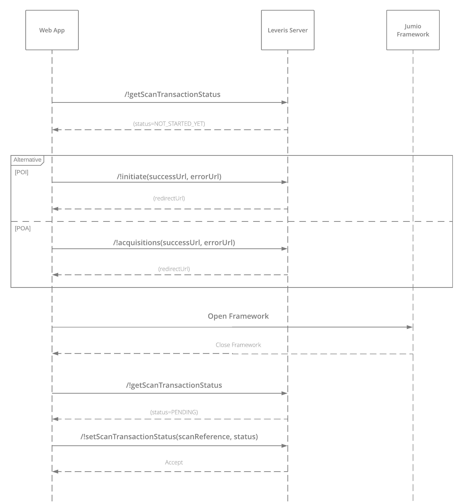

# IB JUMIO

The **jumio service** is responsible for verifing the user´s identity, verifying their address and extracting the information from the uploaded files.

## Responsibilities of the service

The ultimate responsilibity of the service is to verify idenfication and address documents.

It does this by supporting:
* **Document upload** from the user e.g. identity and address documents
* **Data extraction** from the uploaded documents and
* **Document verification**

## How to use the service

The Jumio service is typically kicked off by the [onboarding process](onboarding.md) via a particular  *`code`*.

The entire workflow of processing a document is called a **scan transaction**.

The following **scan transactions** can be requested:
* **Proof of identity (POI)** where the customer will upload identity documents (e.g. passport, driver's license) and take a selfie
* **Proof of address (POA)** where the customer will upload address documents (e.g. bank statements, utility bills)

When the upload is completed, Jumio will:
1. **Extract data** from the files
2. **Perform checks** against the data and documents uploaded
3. **Send results to the Leveris backend**. This happens via a **callback URL** between the Leveris and Jumio system

The API flow for each type of scan transaction is the same, however, the base URLs change slightly:
  * **Proof of identity (POI)**: `api/private/jumio/poi/` eg: `api/private/jumio/poi/!getScanTransactionStatus`
  * **Proof of address (POA)**:  `api/private/jumio/poa/` eg: `api/private/jumio/poa/!getScanTransactionStatus`

However, the API flow varies depending on the channel: **web** or **mobile**.

 ### Handling the mobile channel

1. Call `/!getScanTransactionStatus` to find out whether the transaction is `NOT_STARTED_YET`, `PENDING` or `SUCCESS`. If the transaction is either `NOT_STARTED_YET` or `PENDING` continue to step 2. If `SUCCESS`, continue the onboarding flow

2. Start the scan transaction by calling `/!startScanTransaction`. This returns the data required to configure the Jumio mobile frameworks

3. Open the mobile framework. Depending on the type of **scan transaction**, you will use either:
   - **Netverify** for proof of identity (see [iOS](https://github.com/Jumio/mobile-sdk-ios/blob/master/docs/integration_netverify-fastfill.md) and [Android](https://github.com/Jumio/mobile-sdk-android/blob/master/docs/integration_netverify-fastfill.md)) or
   - **Document verification** for proof of address (see [iOS](https://github.com/Jumio/mobile-sdk-ios/blob/master/docs/integration_document-verification.md) and [Android](https://github.com/Jumio/mobile-sdk-android/blob/master/docs/integration_document-verification.md))

When the framework has finished, the app will get a `scanReference` that must be sent to the server.

4. Call `/!setScanTransaction` to send the `scanReference`

5. Call `/!setScanTransactionStatus` to set the resulting `status` of the process

6. Return to the onboarding flow

### Handling the web channel

1. Call `/!getScanTransactionStatus` to find out whether the transaction is `NOT_STARTED_YET` or `SUCCESS`. If the transaction is either `NOT_STARTED_YET` continue to step 2. If `SUCCESS`, continue the onboarding flow

2. Get the framework url to start the upload. Depending on the type of the scan transaction, you will use either `/!initiate` (proof of identity) or `/!acquisitions` (proof of address). Add the `successUrl` and `errorUrl` to the body of the request. The call returns the `redirectUrl`

3. Call the `redirectUrl` to open the required Jumio framework. When complete, the framework will redirect to one of previously specified URLs: `successUrl` or `errorUrl`

4. Call `/getScanTransactionStatus` to get the actual status of the transaction. If the transaction is pending (status: `PENDING`) move on to the next step

5. Send the `scanReference`and `status` with `/setScanTransactionStatus`

6. Return to the onboarding flow.

### Frameworks

The [Jumio](https://github.com/Jumio/implementation-guides) frameworks are:

* **Netverify** for proof of identity and data extraction
* **Document verification** for proof of address and data extraction
