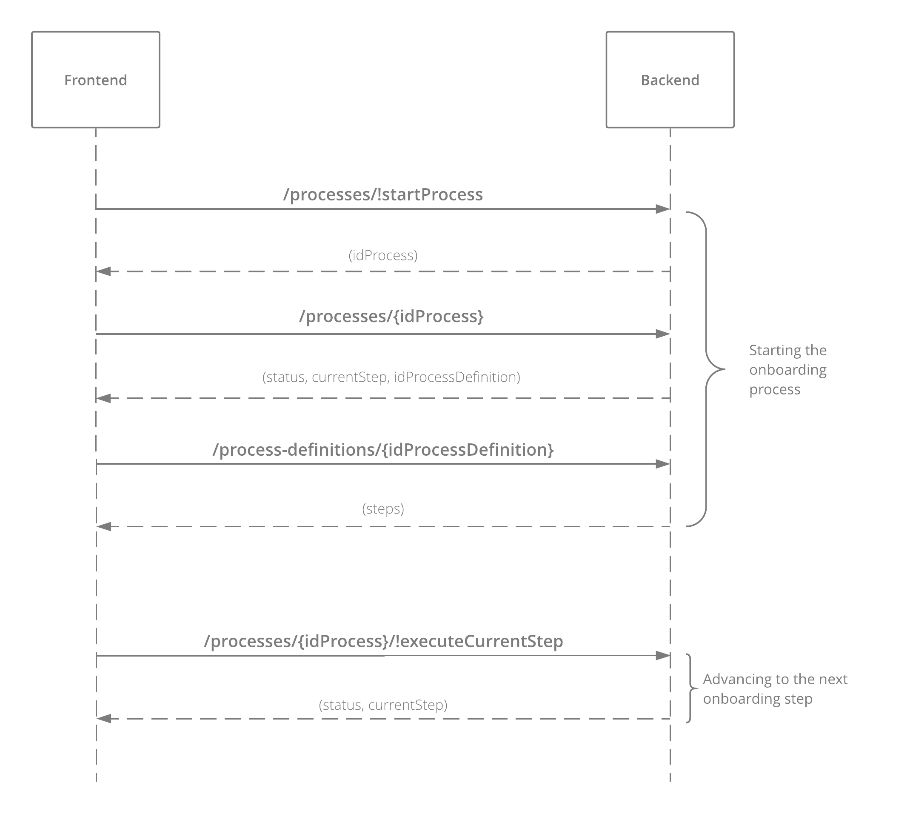

# IB User Activation

The **user activation service** is responsible for creating a customer account, configuring their profile and activating them on the system.

This is also known as the **onboarding service**.

## Responsibilities of the service

The ultimate responsibility is to create a *`Party`* object on the system. When the onboarding starts, the *`Party`* object for that user is created. As the onboarding progresses, more and more customer data will be added to the *`Party`* object.

The *`Party`* object will ultimately contain, or have relations to:
* **Basic user data** e.g. First name, surname
* **Contact details** e.g. Email, phone number
* **Customer consents** to satisfy compliance requirements
* **Security details** for authentication purposes. This includes passwords, device credentials and biometrics
* **Identity and address documentation** for verification purposes. The details of these documents are automatically extracted onto the system

Based on the **Party** data collected, the onboarding process will verify:
* **Contact details** on the email addresses and phone numbers captured and
* **Identity and address documentation** with **KYC** and **AML** checks to satisfy compliance requirements

The process also:
* Facilitates **Recapturing party data** in case a verification has failed
* **Activate a user account** when the *`Party`* has sufficient detail. This allows the user's to access further client services

Don't know what this is:
* Defined *`Product applications`* and *`Pricing schemas`* are ready to be used and setup by the Customer.
** What does 'ready' mean in this case

## How to use the service

Each onboarding process is comprised of a number of pre-defined steps called the *`Process definition`*.

These steps can include:
* **Form steps** to capture textual information from the user. This can include personal details, contact details, passwords etc. (type: `FORM`)
* **Authentication steps** used to verify user contact details or some biometrics (type: `AUTH`)
* **Custom steps** which are used for more specific functionality e.g. KYC and AML processes (type: `CUSTOM`)
* **Application steps** which are used to create products on behalf of the user (type: `APPLICATION`)

The **front-end application** must to follow the *`Process definition`* in order to complete the onboarding.

The *`Process definition`* can also depend on the type of **front-end application** (web or mobile) that the onboarding is started from.

Don't know what this is:
 `/process-definitions`.
`ProcessChannel` .

For steps which require an authentication `/Onboarding - private part` API needs to be used and `/Onboarding - public part` API for the rest.

### Starting the onboarding process

1. Call `/processes/!startProcess` to create a new onboarding process. This will return the id of the new process
2. Call `/processes/{idProcess}` to get the full details of the current onboarding step
3. Optionally call `/process-definitions/{idProcessDefinition}` to get the full list of steps (*`Process definition`*)

### Advancing to the next onboarding step

Once the application has fulfilled the requirements of the current step, call: `/processes/{idProcess}/!executeCurrentStep` to move to the next step.

This will return the next onboarding step or notify the application that the process is complete.

On occasion, `/processes/{idProcess}/!executeCurrentStep` will not need to be called as the execution has been performed by the server. This depends on the specific step type.

  in `/Onboarding - public part` API, and call  endpoint.

Once the process is started We provide you information about what is next step within the process to execute. In order to execute step use `....

When the step is executed, we validate that required conditions for the given step are met. Once the execution is successful We return information about what is next step within the process to execute.
After execution of some specific types of steps We can starts one or more complementary processes on background. In order or get list of processes We recommend you to call `/processes/!list` endpoint in `/Onboarding - private part` after every execution of "private" step. Every process has defined `priority` field which determines a processing order of the processes.

Some types of steps can have more complex flow to execute, see `steps[].stepType` field in `/process-definitions` resource and require some step type specific calls before its execution e.g. `Device setup` API.
Some of them are triggered and executed asynchronously on the Back-end so We provides Consumers application with Event about changes in proces  - `IB_ONBOARDING_PROCESS_CHANGED` event (see [Asynchronous Communication service](mw-gen-asynccomm-ib.md) to get more information).

It has to be configured by Leveris team which steps are included into onboarding process.

Execution of some steps of on-boarding process does not need to require User authentication. It is also matter of step configuration whether user needs to be authenticated or not.

It can be also configured when Customer User account is activated during onboarding process however be aware that it has to be activated after the credentials suitable for the User authentication are collected.
